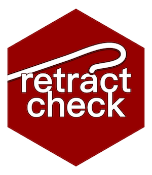

# `retractcheck` 
[](#contributors) 
[](https://travis-ci.org/libscie/retractcheck)

Check DOIs in a paper for being retracted by running your manuscript through `retractcheck` in R or using the [Shiny app](https://frederikaust.shinyapps.io/retractcheck_shinyapp/) in your browser. This R package builds on the API of [Open retractions](http://openretractions.com) ([also an open source project](https://github.com/fathomlabs/open-retractions)). 

The original inspiration for this package can be found [in a tweet by @PaolaPalma](https://twitter.com/PaoloAPalma/status/976545221268815872) and the origin of the name in [this tweet by @MarkHoffarth](https://twitter.com/MarkHoffarth/status/976548240672870405) :fire: 

Retracted papers :books: keep getting cited (see for example [here](https://osf.io/cszpy)) and this package aims to help reduce this effect. [Zotero provides](https://www.zotero.org/blog/retracted-item-notifications/) retraction checking *into* your reference manager, so be sure to check that out too :+1:

## Installation

```R
install.packages('retractcheck')
```

Please note that the dependency on `textreadr` may fail if you don't have the necessary software for that. If installation fails, try `install.packages('textreadr')` and see what errors it gives. It may look like this

```R
Configuration failed because poppler-cpp was not found. Try installing:
 * deb: libpoppler-cpp-dev (Debian, Ubuntu, etc)
 * On Ubuntu 16.04 or 18.04 use this PPA:
    sudo add-apt-repository -y ppa:cran/poppler
    sudo apt-get update
    sudo sudo apt-get install -y libpoppler-cpp-dev
 * rpm: poppler-cpp-devel (Fedora, CentOS, RHEL)
 * csw: poppler_dev (Solaris)
 * brew: poppler (Mac OSX)
```

## Limitations

If the `retractcheck` package does not return any hits for retracted references, please note that the result is only as good as the data made available on this.

## License

[MIT](https://github.com/libscie/retractcheck/blob/master/LICENSE.md)

## Code of conduct

This project is released with a [Contributor Code of Conduct](https://github.com/libscie/retractcheck/blob/master/CODE_OF_CONDUCT.md). By participating in this project you agree to abide by its terms. We welcome you with open arms if you are mindful and respectful of differences. You might not always understand another person's perspective; acknowledging that other people's feelings or perspectives are valid regardless of your understanding is prerequisite number one to being both mindful and respectful. We will not consider contributions if they are not done in a respectful manner, no matter how "genius" they might be.

## Contributor guidelines

* Read the [Code of conduct](https://github.com/libscie/retractcheck/blob/master/CODE_OF_CONDUCT.md)
* Maintainers sign commits with their GPG key (see also [this guide](https://help.github.com/en/articles/signing-commits))
* All contributions and pull requests should only be made if you agree to license your contribution under MIT

## Contributors

Thanks goes to these wonderful people ([emoji key](https://allcontributors.org/docs/en/emoji-key)):

<!-- ALL-CONTRIBUTORS-LIST:START - Do not remove or modify this section -->
<!-- prettier-ignore -->
<table><tr><td align="center"><a href="https://chjh.nl"><br /><sub><b>Chris Hartgerink</b></sub></a><br /><a href="#maintenance-chartgerink" title="Maintenance">🚧</a></td><td align="center"><a href="http://methexp.uni-koeln.de/?page_id=1603&lang=en"><br /><sub><b>Frederik Aust</b></sub></a><br /><a href="https://github.com/libscie/retractcheck/commits?author=crsh" title="Code">💻</a> <a href="#design-crsh" title="Design">🎨</a></td></tr></table>

<!-- ALL-CONTRIBUTORS-LIST:END -->

This project follows the [all-contributors](https://github.com/all-contributors/all-contributors) specification. Contributions of any kind welcome!
